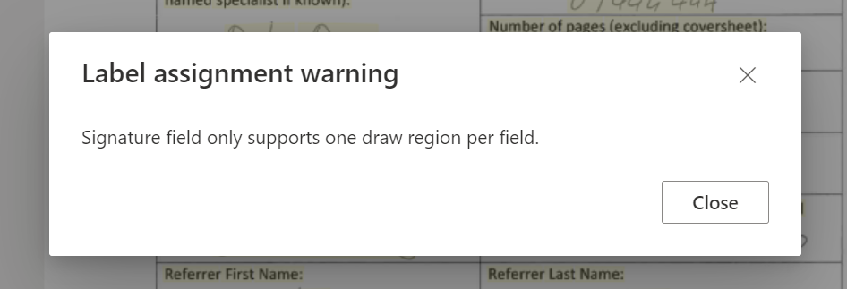

# Azure Form Recognizer: Patient Referrals

> The purpose of this repository is to demonstrate the use of [Azure Form Recognizer](https://azure.microsoft.com/en-au/services/form-recognizer) (v3) in evaluating a patient referral form sent from doctors and hospitals. It is assumed that doctors will attach a [standardized coversheet](/samples/empty-coversheet.pdf) when they refer a patient.

## Introduction

Forms are used to communicate information in every industry, every day. Many people still manually extract data from forms to exchange information. When doctors refer patients to hospitals, they frequently Fax (yes, many still do) the referral to the hospital for administrative purposes. This calls for a series of employees to review the documents upon arrival and enter its details into the system correctly - a laborious task that is prone to human error.

Each health provider has their own style of referral document and while intent and patient data fields are generally present, sometimes information is missing from these highly individual documents. To solve this, one state health authority is now providing a standardised coversheet to be attached to the fax referral, mandating which attributes must be supplied.

Our goal is now to train an Azure Form Recognizer model to label, train, and test the optical character recognition to detect the values supplied in these referral forms, minimising the cognitive effort by frontline workers.

## High-Level: What happens end-to-end?


1. When a new document is uploaded into the `incoming` container of the Storage Account, it is picked up for processing by the Azure Function (which listens for changes to blobs in this containers).
2. The Azure Function reads the data of the blob and makes a call to the Azure Form Recognizer service via the SDK.
3. Form Recognizer performs Optical Character Recognition (OCR) on the document and returns a result set with the text and fields it extracted. Because we trained a custom model, the custom fields we defined are returned in the response too.
4. When the response from Form Recognizer has been received by the calling function, it's overall confidence score is extracted from the result set:
   - If falls below our arbitrary "acceptable" threshold (default 0.8 or 80% overall confidence), it is deemed too inaccurate and moved to the `review` container for manual / human downstream processing.
   - If it it greater than or equal to our pre-defined threshold, it's custom fields are extracted and appended to an Azure Table Storage (this could be any database); and the document itself is moved to the `completed` container.
5. The file, regardless of the outcome is tagged (metadata) with the overall confidence score when it is moved between containers.
6. Once processing has completed and the file has been moved, it will disappear from the `incoming` (source) container.

## Chapter 1: Let's Build - Deploying the Resources

- **Azure Function:** An Azure Function is defined to perform the form recognition and perform conditional actions such as moving the form to a new storage container as per our arbitrary requirements. This function is triggered by a `BlobTrigger` - when a blob in a storage container changes, such as when it is added.
- **Storage Account:** The storage account is the underlying storage medium in our demo, it contains 3 containers and a table store called 'referrals':
  - Incoming: Where new patient referral forms get uploaded and automatically picked up for processing by our Azure Function.
  - Completed: Where processed patient referral forms get loaded into after they have been processed by the Azure Function and deemed "accurate enough" as per our arbitrary definition of overall confidence percentage.
  - Review: Where forms are moved to if the Form Recognizer determines that the overall confidence level of the text extraction is too low as per our arbitrary definition.
  - Referrals: This should not be a storage container but a table storage collection. This is the persistent store to which we will save our form data.
- **Form Recognizer:** The processing service in Azure, part of Azure Cognitive Services or standalone service that can be created as a new resource via the azure portal.

## Chapter 2: Azure Form Recognizer (Custom Form)

In this interactive process, you tell Form Recognizer what text to extract from the coversheet, based on your training dataset of at least 5 images. You may use the [Form Recognizer Studio](https://formrecognizer.appliedai.azure.com) experience to upload a set of coversheet documents (supplied) with different values for the fields (e.g. fields, selection marks, signatures, and tables).

### 1️⃣ Create a Custom Form Project

1. Navigate to [Form Recognizer Studio](https://formrecognizer.appliedai.azure.com) and select: _Custom form_ from the _Custom models_ section.
2. Select: _Create a project_ to create a new custom forms project that will house your patient referral project.
3. Follow the prompts to create a new Custom Forms project:

- **Project Details**
  - Project Name: _Patient Referrals_
  - Description: _Extracts patient referral data from standardized coversheet._
- **Service Resource**
  - Subscription: Select your subscription
  - Resource Group: Select the resource group with your Form Recognizer resource
  - Form Recognizer or Cognitive Service: Select your cognitive service
- **Training Data Source**
  - Subscription: Select your subscription
  - Resource Group: Select the resource group with your Storage Account
  - Storage Account: Select your storage account
  - Blob Container: Select the blob container where your model training data will be located ie. `training`
  - Folder path (optional): Path to your subfolder (if any)
- **Review & Create**
  - Ensure all details are correct and click: _Create Project_

| Project Details                                                                           | Service Resources                                                                                     | Training Source                                                                                   | Review                                                                          |
| :---------------------------------------------------------------------------------------- | :---------------------------------------------------------------------------------------------------- | :------------------------------------------------------------------------------------------------ | :------------------------------------------------------------------------------ |
|  |  |  |  |

#### Are you getting a CORS Error?

If you are seeing the following CORS error after opening the Form Recognizer project, please ensure you follow this [guide to configure CORS](https://docs.microsoft.com/en-us/azure/applied-ai-services/form-recognizer/quickstarts/try-v3-form-recognizer-studio#configure-cors). Please note that the origin URL must not contain a trailing `/` character.


### 2️⃣ Label the Form Fields

1. Copy the sample taining data from the [training samples](samples/01-training) folder into the storage account container you specific for training when you created your project (e.g. `training` container).
2. Open your Form Recognizer Custom Form project to the _Label data_ tab. You should now see a preview of these files.
3. Begin to label the fields you wish to extract. Example: Select the "New Referral" checkbox (don't select the the text, just the checkbox). In the popup box. Type: "Is New Referral", now select "Selection Mark" to indicate this is selection mark field.
4. Repeat step 3 for all responses. Importantly, always select the written response text in the samples, not the header (ie. Referrer Last Name) and ensure you use the correct data type.
   - **Tip:** Give a description key to all data types you label (eg. patient_first_name or is_gender_female). Once all responses have been tagged appropriately, reuse the same labels on the remaining samples of training data.
   - **Tip:** If the text response spans multiple detected fields (eg. Name: `Peter` `Pan` then you can select both and mark them as the name).
5. Once at least 5 samples have been labeled, you are ready to Train the model.

| Initially: Unlabelled Training Dataset                                             | 1. Labelling Selection Marks                                                          | 2. Labelling Text Fields                                                      | 3. Document Regions / Signatures                                               |
| :--------------------------------------------------------------------------------- | :------------------------------------------------------------------------------------ | :---------------------------------------------------------------------------- | :----------------------------------------------------------------------------- |
|  |  |  |  |

#### Update Data Sub Types

If your text fields are dates or integers for example, you may wish to update the sub type of these fields as follows:


#### Are you seeing a 'Label assignment warning'?

This occurs because you may have selected more than one snippet of text when the chosen field type (ie. selection marks or signatures) only support one. Simply click out of the document and back into it to clear your selection and try again.



### 3️⃣ Training the Model

> ⚠️ Please remember that (at the time of writing this) least 5 OCR files are required to train a model. A 'ModelBuildError' will appear if you attempt to train with less than 5 files.

1. In the _Label data_ tab, click the _Train_ button in the top right corner
2. Enter a Model ID and Description
3. Click: _Train_
4. Once trained, the model will be displayed in the _Models_ tab


### 4️⃣ Optional: Testing the Model (for accuracy)

Once you have trained a model, you can test it:

1. Navigate to the _Test_ tab
2. Select your model in the drop-down next to the "Test model" title
3. Add some sample testing data by clicking the `+ Add` button
4. Pick one or more files from the [testing samples](samples/02-testing) folder. These vary from the coversheet images used in the initial training set to avoid bias by 100% matching against the model's training data.
5. Click _Analyse_ to process the file(s)
6. View the document analysis results (on the right)

🎉 Congratulations! You have successfully deployed, labeled, trained, and tested an Azure Form Recognizer Custom Form!

## Chapter 3: Azure Function with Form Recognizer SDK

In this chapter, we are looking at implementing the Azure Function code for the Azure Function App you deployed in chapter 1. Please note that Azure Functions supports a range of common programming languages - [documented here](https://docs.microsoft.com/en-us/azure/azure-functions/supported-languages).

It is also possible to use "no/low-code" tools including [Azure Logic Apps](https://azure.microsoft.com/en-au/services/logic-apps) or [Power Automate](https://powerautomate.microsoft.com/en-us) for this scenario. However, this example shows the use of a Blob-triggered Azure Function with the TypeScript language.

### 1️⃣ Deploying the Code

It is assumed you have basic coding knowledge and are familiar with the concept of CI/CD to deploy the Function App code with version control in mind.

1. Create a new "Blob Trigger" function in the Azure Function App and use the TypeScript / JavaScript code supplied in the [index.ts](./patient-referral-form-recognizer/index.ts) file.
2. Configure the following environment variables to connect the Azure Function to the Storage Account and Form Recognizer instance deployed in Chapter 1.

```json
{
  "MIN_CONFIDENCE_SCORE": 0.8, // Minimum acceptable confidence (between 0-1)
  "FORM_RECOGNIZER_STORAGE": "DefaultEndpointsProtocol=https;AccountName=[...];AccountKey=[...];EndpointSuffix=core.windows.net",
  "FORM_RECOGNIZER_API_KEY": "[...]",
  "FORM_RECOGNIZER_MODEL_ID": "[...]",
  "FORM_RECOGNIZER_ENDPOINT": "https://[...].cognitiveservices.azure.com"
}
```

> ℹ️ To locate the Storage Account connection string for `FORM_RECOGNIZER_STORAGE`, navigate to your _Storage Account_ in the Azure Portal, click on _Access Keys_ and copy the _Connection String_ value of either _key1_ or _key2_.

Now that your function code is deployed. It whenever a new blob is added into the Storage Account container, the function is triggered and begins processing the blob. As per the Function App code, the output will be saved into Azure Table Storage, a cheap, and extremely fast key-value pair store. You may decide to switch this out for a SQL Database to meet your operational needs.

## Chapter 4: What just happened?

If you have made it this far, you will see that your detected fields have been saved into Azure Table Storage as per out architecture diagram.


Additionally, the processed file - with confidence metadata added - is moved from the `incoming` container to either the `processed` or `review` container depending on whether the confidence score is greater than or less than the `MIN_CONFIDENCE_SCORE` threshold defined in our environment variables:


## Chapter 5: Copying models between instances

In the real scenario that you have multiple instances of Azure Form Recognizer for dev/test and prod for instance, you may wish to copy a model you trained in your dev/test environment into the production environment.

> ✨ **Tip:** The Form Recognizer Studio (web interface) does not currently support this feature. However, it is simple to [use the API](https://australiaeast.dev.cognitive.microsoft.com/docs/services/form-recognizer-api-v3-0-preview-1) in this scenario, or [download the API Definition](https://australiaeast.dev.cognitive.microsoft.com/docs/services/form-recognizer-api-v3-0-preview-1/export?DocumentFormat=Swagger&ApiName=Form%20Recognizer%202021-09-30-preview) and import it into [Postman](https://www.postman.com/) or other HTTP clients.

**Pre-requisites:** We need to collect the following four pieces of information:

- Dev/Test Form Recognizer Key
- Prod Form Recognizer Key
- The Model ID which we wish to copy from Dev/Test to Prod
- Region of the Dev/Test and Prod Instances


### 1️⃣ Generating a Copy Authorization

We first [Generate a Copy Authorization](https://australiaeast.dev.cognitive.microsoft.com/docs/services/form-recognizer-api-v3-0-preview-1/operations/AuthorizeCopyDocumentModel). This generates an authorization key we can user to copy a model to this location with specified model id and optional description.

#### Query Parameters

- `Ocp-Apim-Subscription-Key`: Must contain the key of the destination Form Recognizer instance, in this case the _Production Form Recognizer Key_ (copied earlier).
- `Content-Type`: Must be set to `application/json`

#### Request Body

We supply the name that we would like to give our model upon transfer, and an optional description.

```json
{
  "modelId": "TransferredModel",
  "description": "This is a description for our copied model, as it will appear in the target resource."
}
```

#### Example: Getting a Model Copy Authorization

```http
POST https://australiaeast.api.cognitive.microsoft.com/formrecognizer/documentModels:authorizeCopy?api-version=2021-09-30-preview HTTP/1.1
Host: australiaeast.api.cognitive.microsoft.com
Content-Type: application/json
Ocp-Apim-Subscription-Key: ••••••••••••••••••••••••••••••••

{
  "modelId": "TransferredModel",
  "description": "This is a description for our copied model, as it will appear in the target resource."
}
```

##### Sample API Response

We need to copy the response body for the next step.

```json
...
{
  "targetResourceId": "/subscriptions/[subscription_id]/resourceGroups/[resource_group]/providers/Microsoft.CognitiveServices/accounts/[prod-form-recognizer-name]",
  "targetResourceRegion": "australiaeast",
  "targetModelId": "TransferredModel",
  "targetModelLocation": "https://australiaeast.api.cognitive.microsoft.com/formrecognizer/documentModels/TransferredModel?api-version=2021-09-30-preview",
  "accessToken": "ffd3e3f9-e9de-4e9c-b29d-4ac16bdf4f3e",
  "expirationDateTime": "2022-02-01T09:58:50Z"
}
```

### 2️⃣ Copying the Model to Production

Now that we have an authorization token in hand, we can invoke the [Copy Model API](https://australiaeast.dev.cognitive.microsoft.com/docs/services/form-recognizer-api-v3-0-preview-1/operations/CopyDocumentModelTo), which copies the model to the target (production) resource.

#### Query Parameters

- `modelId`: Must contain the ID of the model we wish to transfer (i.e. the ID of the model we trained in Chapter 2 and now wish to copy to the production environment).

#### Request Headers

- `Ocp-Apim-Subscription-Key`: Must contain the key of the source Form Recognizer instance, in this case the _Dev/Test Form Recognizer Key_ (copied earlier).
- `Content-Type`: Must be set to `application/json`

#### Request Body

We simply copy the response body from the previous step, which contains the authorization token and resource information.

```json
{
  "targetResourceId": "/subscriptions/[subscription_id]/resourceGroups/[resource_group]/providers/Microsoft.CognitiveServices/accounts/[prod-form-recognizer-name]",
  "targetResourceRegion": "australiaeast",
  "targetModelId": "TransferredModel",
  "targetModelLocation": "https://australiaeast.api.cognitive.microsoft.com/formrecognizer/documentModels/TransferredModel?api-version=2021-09-30-preview",
  "accessToken": "ffd3e3f9-e9de-4e9c-b29d-4ac16bdf4f3e",
  "expirationDateTime": "2022-02-01T09:58:50Z"
}
```

When the request is made, you should receive a `202 Accepted` status code. This indicates that the model will now be copied in the background. For error codes and up-to-date information, please refer to the [Cognitive Services API Documentation](https://australiaeast.dev.cognitive.microsoft.com/docs/services/form-recognizer-api-v3-0-preview-1/operations/CopyDocumentModelTo)

🎉 Congratulations, you have successfully copied the model from one instance to another.

### Conclusion

Azure Form Recognizer is just one of multiple Applied AI services available in the Azure cloud. The implementation of this service repends on the scenario and (for demo purposes) does not currently account for additional security requirements your organization may have.

If you found this resource helpful, feel free to [connect with me on LinkedIn](https://linkedin.com/in/olafwrieden) or make my day by buying me a coffee to keep fuelling projects like these.

<a href="https://www.buymeacoffee.com/olafwrieden" target="_blank"></a>

Best regards,
[Olaf Wrieden](https://linkedin.com/in/olafwrieden)

```

```
