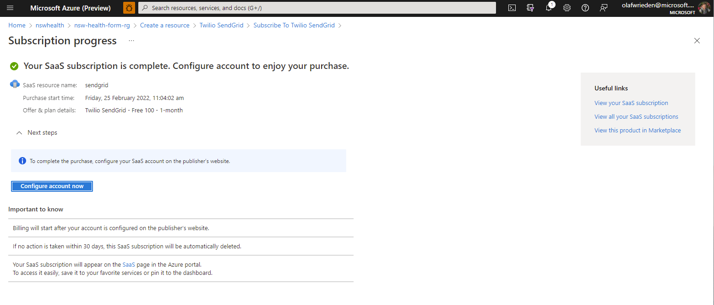
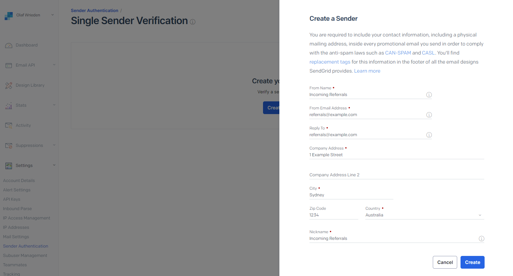
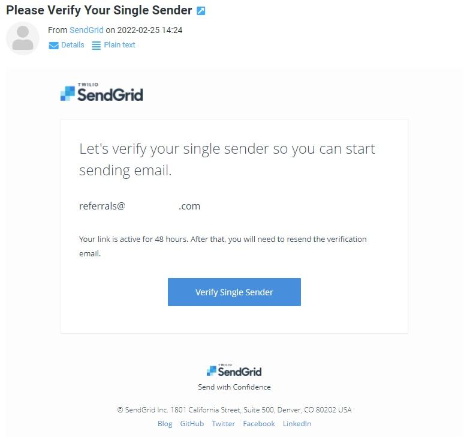
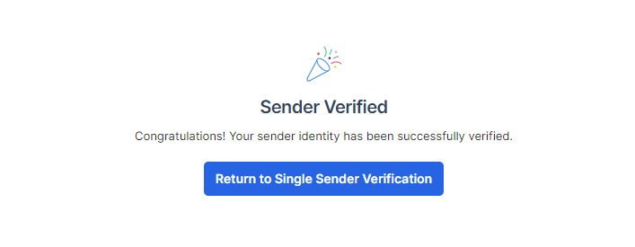

# Email on Failed Referral

> This is the function used to send automated emails to a given mailbox when a new blob lands in the connected container, pending human review.

Details on the SendGrid setup are: [Documented here](https://docs.microsoft.com/en-us/azure/azure-functions/functions-bindings-sendgrid?tabs=javascript).

This comprises of several steps:

1. Deploy a SendGrid Resource from the Azure Marketplace.
2. Configure Sender (or Domain) Verification
3. Update the Function App Configuration

## Deployment Steps

1. Deploy SendGrid (Azure SaaS Resource)
   

2. Single Sender Verification (or domain verfication)
   

3. Go to the inbox of this sender and click on the link to verify
   

4. This sender has now been verified
   

## SendGrid Bindings

Azure Functions allow us to define function bindings which act as either input or outputs of the function. While we use a blob trigger input (to initiate the function), we use the SendGrid output to send email via SendGrid.

Documentation: [SendGrid bindings for Azure Functions](https://docs.microsoft.com/en-us/azure/azure-functions/functions-bindings-sendgrid?tabs=javascript)

## Setting Environment Variables

In addition to Form Recognizer environment variables, the following variables have been created for SendGrid:

```javascript
"SENDGRID_API_KEY": "<INSERT SENDGRID API KEY>",
"SENDGRID_FROM_ADDRESS": "Referrals Automation <referrals@example.com>",
"EMAIL_TO_ADDRESSES": "recipient1@example.com;recipient2@example.com"
```

The `SENDGRID_FROM_ADDRESS` needs to be updated to the email address which you verified in the previous steps.

The `EMAIL_TO_ADDRESSES` are a semicolon-separated list of recipient email addresses. If only one recipient is required, do not include the `;` semicolon at the end of the address.
